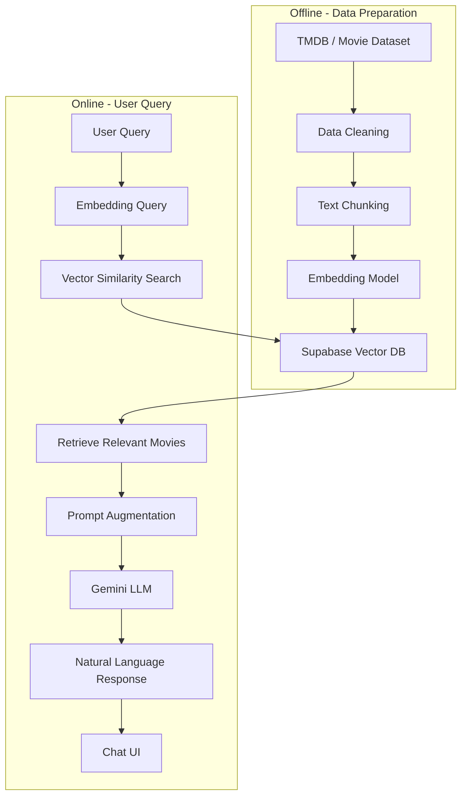

# 🎬 AI Movie Chatbot (RAG)

<div align="center">

[](https://nextjs.org/)
[](https://www.typescriptlang.org/)
[](https://tailwindcss.com/)
[](https://supabase.com/)
[](https://ai.google.dev/)
[](https://opensource.org/licenses/MIT)

**Hệ thống tìm kiếm và gợi ý phim thông minh ứng dụng kiến trúc Retrieval-Augmented Generation (RAG)**
<br />
🌐 [Xem Demo](https://your-domain.vercel.app)
🐞 [Báo Lỗi](https://github.com/SonCryptoz/ai-movie-chatbot/issues)
</div>

## 📖 Giới thiệu

**AI Movie Chatbot** là một ứng dụng web hiện đại cho phép người dùng tương tác với dữ liệu điện ảnh thông qua ngôn ngữ tự nhiên. Khác với các chatbot thông thường, dự án này sử dụng kỹ thuật **RAG**, kết hợp sức mạnh lập luận của **Gemini LLM** với cơ sở dữ liệu phim thực tế được lưu trữ dưới dạng **Vector Embeddings** trong Supabase.

### 🎯 Mục tiêu dự án
- **Thực hành AI + Web App:** Xây dựng sản phẩm hoàn chỉnh từ giao diện đến tích hợp trí tuệ nhân tạo.
- **Áp dụng RAG:** Giải quyết vấn đề "ảo giác" (hallucination) của AI bằng cách cung cấp ngữ cảnh dữ liệu chính xác.
- **Showcase kỹ năng:** Trình bày khả năng xử lý Fullstack (Next.js, Supabase) và tích hợp AI API.
---

## ✨ Tính năng chính

- 🔍 **Tìm kiếm ngữ nghĩa (Semantic Search):** Tìm phim dựa trên ý nghĩa câu hỏi.
- 🤖 **Gợi ý phim AI:** Đề xuất danh sách phim dựa trên ngữ cảnh cuộc trò chuyện và sở thích cá nhân.
- ⚖️ **So sánh thông minh:** So sánh nhiều phim cùng lúc với bảng thông số chi tiết và đánh dấu "phim vượt trội".
- 📊 **Trực quan hóa dữ liệu:** Sử dụng biểu đồ Radar, biểu đồ cột để so sánh Rating và Thể loại.
- 🎨 **Giao diện đa dạng:** Hỗ trợ thay đổi nhiều Theme (Retro, Dark, Cyberpunk) nhờ DaisyUI.
- 💬 **Trải nghiệm Chat mượt mà:** Hệ thống gợi ý Prompt thông minh giúp người dùng bắt đầu cuộc hội thoại dễ dàng.
---

## 🧠 Kiến trúc hệ thống (RAG Flow)

---
## 🛠 Công nghệ sử dụng

-  **Next.js 16 (App Router)**

-  **TypeScript**

-  **Tailwind CSS + DaisyUI**

-  **Zustand** (state management)

-  **Framer Motion** (animation)

-  **Gemini API** (LLM)

-  **Supabase / Vector DB** (lưu embedding cho RAG)
---

## 🚀 Cài đặt

### Clone Project

```bash
git clone https://github.com/SonCryptoz/ai-movie-chatbot.git
cd ai-movie-chatbot
```

### Cài dependencies

```bash
npm i
```

### Tạo file môi trường .env.local

```bash
GEMINI_API_KEY=your_gemini_key

SUPABASE_URL=your_supabase_url

SUPABASE_ANON_KEY=your_anon_key

SUPABASE_SERVICE_ROLE_KEY=your_service_role

SUPABASE_PRJ_PASSWORD=your_password

TMDB_API_KEY=your_tmdb_key

NEXT_PUBLIC_BASE_URL=your_app_url
```

### Thiết lập Database (Supabase)

```sql
create table public.movie_embeddings (
  id bigint not null,
  title text null,
  content text null,
  embedding public.vector null,
  year integer null,
  rating double precision null,
  genres text[] null,
  popularity double precision null,
  language text null,
  runtime integer null,
  source text null,
  poster_url text null,
  constraint movie_embeddings_pkey primary key (id)
) TABLESPACE pg_default;

create index IF not exists movie_embeddings_embedding_idx on public.movie_embeddings using ivfflat (embedding vector_cosine_ops)
with
  (lists = '100') TABLESPACE pg_default;

create index IF not exists movie_embeddings_poster_url_idx on public.movie_embeddings using btree (poster_url) TABLESPACE pg_default;
```
### Tạo Function tìm kiếm Vector (RAG core)

```sql
create or replace function match_movies(
  query_embedding vector(1536),
  match_count int,
  genre_filter text[] default null,
  year_min int default null,
  year_max int default null,
  rating_min float default null
)
returns table (
  id int,
  title text,
  content text,
  year int,
  rating float,
  genres text[],
  popularity float,
  runtime int,
  language text,
  source text,
  poster_url text
)
language sql
stable
as $$
  select
    id,
    title,
    content,
    year,
    rating,
    genres,
    popularity,
    runtime,
    language,
    source,
    poster_url
  from movie_embeddings
  where
    (genre_filter is null or genres && genre_filter)
    and (year_min is null or year >= year_min)
    and (year_max is null or year <= year_max)
    and (rating_min is null or rating >= rating_min)
    and rating is not null
  order by
    (embedding <=> query_embedding)
    - (coalesce(rating, 0) * 0.03)
    - (coalesce(popularity, 0) * 0.005)
  limit match_count;
$$;
```

### Chạy scripts

```bash
npm run crawl   # Lấy dữ liệu từ TMDB
npm run embed   # Chuyển đổi mô tả phim sang vector
npm run ingest  # Đẩy dữ liệu vào Supabase
```

### Chế độ Development

```bash
npm run dev
```  

### Truy cập

```bash
http://localhost:3000
```
---

## 💡 Ví dụ câu hỏi

```txt
Find a family movie

Show me an animation movie

Compare Inception vs Interstellar

Best movie about animals
```
---

## 📁 Cấu trúc thư mục

```txt
/app
    /api            # API routes (chat, search, AI handler)
    /chat           # Trang giao diện chat
    /data           # Trang hiển thị dữ liệu phim
    /movie          # Trang chi tiết từng phim (movie/[id])
    /settings       # Trang cấu hình người dùng
    globals.css
    layout.tsx
    page.tsx
    theme-provider.tsx

/components
    /chat           # Component cho UI chat
    /data           # Component bảng & biểu đồ
    /movie          # Card, panel, compare table
    /settings       # Component cài đặt
    /ui             # Button, modal, input, chart...

/data              # Dataset phim thô và đã xử lý
/lib               # Helper functions, API clients
/public            # Static assets (images, icons)
/scripts           # Crawl, embed, ingest dữ liệu
/store             # Zustand store (chat, movie panel)
```
---

## 🎯 Mục tiêu học tập

- [x] **RAG:** Triển khai thành công quy trình Retrieval-Augmented Generation.
- [x] **AI Integration:** Tích hợp Gemini API và tối ưu hóa Prompt Engineering.
- [x] **Vector Database:** Làm chủ Supabase pgvector để tìm kiếm dữ liệu theo ngữ nghĩa.
- [x] **Modern Fullstack:** Thành thạo Next.js 16+ (App Router) và quản lý state với Zustand.
- [x] **Data Visualization:** Trực quan hóa dữ liệu AI thông qua biểu đồ sinh động.
---

## 🧭 Hướng phát triển

💾 Lưu lịch sử chat theo người dùng
**Cho phép mỗi user có lịch sử hội thoại riêng, đồng bộ giữa nhiều thiết bị.**

🔐 Hệ thống đăng nhập / đăng ký
**Xác thực bằng email, OAuth (Google, GitHub), hoặc Supabase Auth.**

🗃️ Mở rộng nguồn dữ liệu phim
**Kết hợp nhiều API (TMDB, IMDb, Wikipedia, Review sites) để tăng độ chính xác.**

🌍 Hỗ trợ đa ngôn ngữ
**Cho phép người dùng chat và nhận kết quả bằng nhiều ngôn ngữ khác nhau.**

🎯 Cá nhân hóa gợi ý phim

        Lịch sử chat

        Thể loại yêu thích

        Rating người dùng

        Hành vi tương tác
---

## 🙏 Lời cảm ơn

Dự án này sẽ không thể hoàn thiện nếu thiếu sự hỗ trợ từ các công cụ và nền tảng sau:

- **TMDB API** – Cung cấp nguồn dữ liệu phim phong phú và cập nhật.  
- **Supabase** – Lưu trữ dữ liệu và Vector Embeddings phục vụ cho hệ thống RAG.  
- **Google Gemini API** – Mô hình ngôn ngữ lớn dùng để sinh câu trả lời tự nhiên.  
- **Next.js & Tailwind CSS** – Nền tảng xây dựng giao diện web hiện đại và hiệu năng cao.  
- **Zustand & Framer Motion** – Quản lý state và animation giúp trải nghiệm người dùng mượt mà hơn.

Ngoài ra, xin gửi lời cảm ơn đến cộng đồng **Open Source** và các tác giả blog, tutorial về:

- **Retrieval-Augmented Generation (RAG)**  
- **Vector Database**  
- **AI + Web Application**

Những tài liệu và ví dụ thực tế từ cộng đồng đã góp phần quan trọng trong việc xây dựng và hoàn thiện dự án này. ❤️