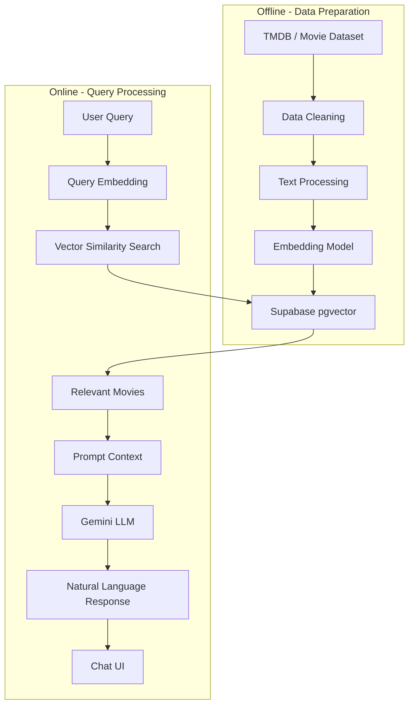

# AI Movie Chatbot

<div align="center">

[](https://nextjs.org/)
[](https://www.typescriptlang.org/)
[](https://tailwindcss.com/)
[](https://supabase.com/)
[](https://ai.google.dev/)
[](https://opensource.org/licenses/MIT)

**Ứng dụng chatbot phim sử dụng Retrieval-Augmented Generation (RAG)**
<br />
[Demo](https://ai-movie-chatbot-nw4x.onrender.com) - [Báo Lỗi](https://github.com/SonCryptoz/ai-movie-chatbot/issues)
</div>

## Giới thiệu

**AI Movie Chatbot** là ứng dụng web cho phép người dùng tìm kiếm, so sánh và nhận gợi ý phim thông qua ngôn ngữ tự nhiên.

Thay vì chỉ gửi câu hỏi trực tiếp đến mô hình ngôn ngữ, ứng dụng sử dụng kiến trúc **Retrieval-Augmented Generation (RAG)** để tìm kiếm thông tin phim liên quan từ cơ sở dữ liệu trước khi tạo câu trả lời.

Dữ liệu phim được chuyển thành **vector embeddings** và lưu trữ trong **Supabase PostgreSQL với pgvector**. Khi người dùng gửi câu hỏi, hệ thống tạo embedding cho truy vấn, thực hiện tìm kiếm tương đồng vector và đưa các kết quả phù hợp vào context của **Gemini LLM** để tạo câu trả lời.

Dự án được xây dựng bằng **Next.js 16 App Router, TypeScript, Supabase, Gemini API và Zustand**.

## Tính năng

### Tìm kiếm và gợi ý phim

* Tìm kiếm phim bằng ngôn ngữ tự nhiên.
* Semantic Search dựa trên vector embeddings.
* Gợi ý phim dựa trên nội dung truy vấn và context cuộc trò chuyện.
* Lọc kết quả theo thể loại, năm phát hành và rating.
* Hiển thị thông tin chi tiết của phim.

### So sánh phim

* So sánh nhiều bộ phim trong cùng một giao diện.
* Hiển thị thông tin như rating, runtime, popularity và thể loại.
* Sử dụng bảng so sánh để làm nổi bật các tiêu chí giữa các phim.
* Hỗ trợ AI phân tích và đưa ra nhận xét dựa trên dữ liệu được retrieve.

### Trực quan hóa dữ liệu

* Biểu đồ Radar để so sánh các tiêu chí.
* Biểu đồ rating và thể loại.
* Hiển thị dữ liệu phim trực quan bên cạnh nội dung chat.

### Chat UI

* Giao diện chat tương tác.
* Prompt suggestions giúp người dùng bắt đầu cuộc trò chuyện.
* Movie panel hiển thị thông tin phim ngay trong giao diện chat.
* Hỗ trợ nhiều theme thông qua DaisyUI.

## Kiến trúc RAG

Hệ thống được chia thành hai pipeline chính: **offline data preparation** và **online query processing**.



### RAG Flow

1. Dữ liệu phim được lấy từ TMDB hoặc dataset nguồn.
2. Dữ liệu được làm sạch và chuẩn hóa thành nội dung có thể embedding.
3. Embedding model chuyển nội dung phim thành vector 384 chiều.
4. Vector và metadata được lưu trong Supabase pgvector.
5. Khi người dùng gửi câu hỏi, hệ thống tạo embedding cho query.
6. Supabase thực hiện vector similarity search để tìm các phim liên quan.
7. Kết quả tìm kiếm được đưa vào prompt context.
8. Gemini sử dụng context này để tạo câu trả lời.
9. Kết quả được hiển thị trên giao diện chat.

## Công nghệ

### Frontend

* **Next.js 16 / App Router** – Framework chính cho ứng dụng.
* **TypeScript** – Static typing.
* **Tailwind CSS** – Styling và responsive layout.
* **DaisyUI** – UI components và theme.
* **Zustand** – Quản lý global state.
* **Framer Motion** – Animation và UI transitions.

### AI & Data

* **Google Gemini API** – Large Language Model dùng để tạo câu trả lời.
* **Supabase / PostgreSQL** – Lưu trữ metadata phim và vector embeddings.
* **pgvector** – Vector similarity search.
* **Embedding Model** – Chuyển dữ liệu phim và user query thành vector 384 chiều.
* **TMDB API** – Nguồn dữ liệu phim.

## Database

Bảng chính được sử dụng cho RAG:

```sql
create table public.movie_embeddings (
  id bigint not null,
  title text null,
  content text null,
  embedding vector(384) null,
  year integer null,
  rating double precision null,
  genres text[] null,
  popularity double precision null,
  language text null,
  runtime integer null,
  source text null,
  poster_url text null,
  constraint movie_embeddings_pkey primary key (id)
);
```

Vector index được sử dụng để hỗ trợ similarity search:

```sql
create index if not exists movie_embeddings_embedding_idx
on public.movie_embeddings
using ivfflat (embedding vector_cosine_ops)
with (lists = '100');
```

Index cho poster URL:

```sql
create index if not exists movie_embeddings_poster_url_idx
on public.movie_embeddings
using btree (poster_url);
```

## Vector Search Function

Function `match_movies` thực hiện semantic search kết hợp với một số điều kiện lọc metadata.

```sql
create or replace function match_movies(
  query_embedding vector(1536),
  match_count int,
  genre_filter text[] default null,
  year_min int default null,
  year_max int default null,
  rating_min float default null
)
returns table (
  id int,
  title text,
  content text,
  year int,
  rating float,
  genres text[],
  popularity float,
  runtime int,
  language text,
  source text,
  poster_url text
)
language sql
stable
as $$
  select
    id,
    title,
    content,
    year,
    rating,
    genres,
    popularity,
    runtime,
    language,
    source,
    poster_url
  from movie_embeddings
  where
    (genre_filter is null or genres && genre_filter)
    and (year_min is null or year >= year_min)
    and (year_max is null or year <= year_max)
    and (rating_min is null or rating >= rating_min)
    and rating is not null
  order by
    (embedding <=> query_embedding)
    - (coalesce(rating, 0) * 0.03)
    - (coalesce(popularity, 0) * 0.005)
  limit match_count;
$$;
```

Phần `ORDER BY` kết hợp **cosine distance** với rating và popularity để ưu tiên những kết quả vừa có độ tương đồng với query vừa có metadata phù hợp.

## Cài đặt

### 1. Clone repository

```bash
git clone https://github.com/SonCryptoz/ai-movie-chatbot.git
cd ai-movie-chatbot
```

### 2. Cài dependencies

```bash
npm install
```

### 3. Cấu hình environment variables

Tạo file `.env.local`:

```env
GEMINI_API_KEY=your_gemini_key

SUPABASE_URL=your_supabase_url
SUPABASE_ANON_KEY=your_anon_key
SUPABASE_SERVICE_ROLE_KEY=your_service_role

SUPABASE_PRJ_PASSWORD=your_password

TMDB_API_KEY=your_tmdb_key

NEXT_PUBLIC_BASE_URL=http://localhost:3000
```

Các secret key chỉ nên được sử dụng ở server-side và không commit vào repository.

### 4. Thiết lập Supabase

Tạo bảng `movie_embeddings` và các index cần thiết bằng SQL ở phần **Database**.

Sau đó tạo RLS policy phù hợp với cách ứng dụng truy cập dữ liệu:

```sql
create policy "public read"
on public.movie_embeddings
as permissive
for select
to public
using (true);
```

Trong môi trường production, policy nên được giới hạn theo yêu cầu bảo mật thực tế thay vì cho phép public read nếu không cần thiết.

### 5. Chuẩn bị dữ liệu

Các script xử lý dữ liệu:

```bash
npm run crawl
npm run embed
npm run ingest
```

Trong đó:

* `crawl` – Thu thập dữ liệu phim.
* `embed` – Tạo vector embedding.
* `ingest` – Đưa dữ liệu và embeddings vào Supabase.

### 6. Chạy development server

```bash
npm run dev
```

Truy cập:

```text
http://localhost:3000
```

## Ví dụ truy vấn

```text
Find a family movie

Show me an animation movie

Compare Inception vs Interstellar

Best movie about animals

Recommend some highly rated science fiction movies

Find movies similar to Interstellar
```

## Cấu trúc thư mục

```text
ai-movie-chatbot/
│
├── app/
│   ├── api/                    # API routes
│   ├── chat/                   # Chat page
│   ├── data/                   # Movie data page
│   ├── movie/                  # Movie detail pages
│   │   └── [id]/
│   ├── settings/               # User settings
│   ├── globals.css
│   ├── layout.tsx
│   ├── page.tsx
│   └── theme-provider.tsx
│
├── components/
│   ├── chat/                   # Chat components
│   ├── data/                   # Tables and charts
│   ├── movie/                  # Movie cards and comparison UI
│   ├── settings/               # Settings components
│   └── ui/                     # Shared UI components
│
├── data/                       # Raw and processed movie data
├── lib/                        # Helpers and API clients
├── public/                     # Static assets
├── scripts/                    # Crawl, embedding and ingestion scripts
├── store/                      # Zustand stores
│
├── .env.local
├── next.config.ts
├── package.json
└── README.md
```

## Những gì đã học được

Thông qua dự án này, tôi có cơ hội thực hành:

* Xây dựng ứng dụng fullstack với Next.js App Router và TypeScript.
* Thiết kế và triển khai pipeline Retrieval-Augmented Generation.
* Hiểu cách semantic search hoạt động với vector embeddings.
* Sử dụng PostgreSQL và pgvector cho vector similarity search.
* Tích hợp Gemini API vào ứng dụng thực tế.
* Xây dựng prompt context dựa trên dữ liệu được retrieve.
* Xử lý và chuẩn bị dataset trước khi embedding.
* Quản lý global state bằng Zustand.
* Xây dựng UI tương tác và responsive với Tailwind CSS và DaisyUI.
* Trực quan hóa dữ liệu phim bằng các loại biểu đồ khác nhau.
* Tách data preparation pipeline khỏi quá trình xử lý query realtime.

## Hạn chế khi triển khai

Phiên bản demo hiện được triển khai trên **Render Free Tier**, vì vậy tài nguyên CPU và RAM bị giới hạn.

Một số tác động có thể gặp:

* Cold start khiến thời gian phản hồi ban đầu tăng.
* Các request cần xử lý nhiều dữ liệu có thể mất nhiều thời gian hơn.
* Những truy vấn phức tạp như so sánh hoặc recommendation nhiều phim có thể gặp timeout.
* Việc chạy embedding model trong môi trường tài nguyên thấp có thể ảnh hưởng đến thời gian xử lý.
* Một số lỗi runtime có thể xảy ra do giới hạn tài nguyên của môi trường deployment.

Phiên bản hiện tại chủ yếu phục vụ **demo và mục đích học tập**, chưa được tối ưu cho workload production hoặc lượng truy cập lớn.

## Hướng phát triển

Một số hướng có thể mở rộng trong tương lai:

* Thêm authentication và lưu lịch sử chat theo từng người dùng.
* Đồng bộ conversation giữa nhiều thiết bị.
* Mở rộng nguồn dữ liệu từ nhiều nguồn khác nhau.
* Cải thiện hybrid search bằng cách kết hợp semantic search và keyword search.
* Cải thiện ranking bằng các tiêu chí metadata và relevance khác nhau.
* Hỗ trợ đa ngôn ngữ cho query và response.
* Cá nhân hóa recommendation dựa trên lịch sử tương tác và sở thích của người dùng.
* Cải thiện caching và inference pipeline để giảm thời gian phản hồi.
* Chuyển embedding service sang infrastructure riêng khi cần scale.

## Lời cảm ơn

Dự án này sẽ không thể hoàn thiện nếu thiếu sự hỗ trợ từ các công cụ và nền tảng sau:

- **TMDB API** – Cung cấp nguồn dữ liệu phim phong phú và cập nhật.  
- **Supabase** – Lưu trữ dữ liệu và Vector Embeddings phục vụ cho hệ thống RAG.  
- **Google Gemini API** – Mô hình ngôn ngữ lớn dùng để sinh câu trả lời tự nhiên.  
- **Next.js & Tailwind CSS** – Nền tảng xây dựng giao diện web hiện đại và hiệu năng cao.  
- **Zustand & Framer Motion** – Quản lý state và animation giúp trải nghiệm người dùng mượt mà hơn.

Ngoài ra, xin gửi lời cảm ơn đến cộng đồng **Open Source** và các tác giả blog, tutorial về:

- **Retrieval-Augmented Generation (RAG)**  
- **Vector Database**  
- **AI + Web Application**

Những tài liệu và ví dụ thực tế từ cộng đồng đã góp phần quan trọng trong việc xây dựng và hoàn thiện dự án này. ❤️
